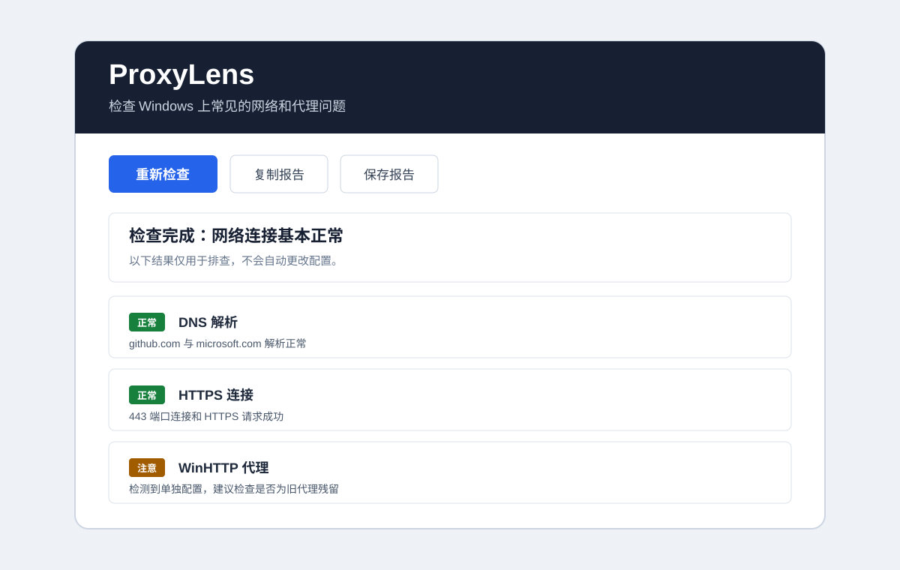

# ProxyLens

A small, read-only Windows utility for diagnosing proxy, DNS, and HTTPS connection problems.

[](https://github.com/bluetn514/proxylens/releases/latest)
[](https://github.com/bluetn514/proxylens/actions/workflows/test.yml)
[](LICENSE)

[Download for Windows](https://github.com/bluetn514/proxylens/releases/latest) · [中文](README.md) · [Report a problem](https://github.com/bluetn514/proxylens/issues/new?template=bug_report.yml)



ProxyLens brings the checks you usually run one by one into a single window. It helps narrow down whether a connection problem is related to a stale proxy, DNS resolution, a local proxy port, TCP connectivity, or HTTPS itself.

It does not change your proxy or DNS settings and does not upload diagnostic data. Reports can be copied or saved with common sensitive fields redacted.

## Checks

- Windows and environment-variable proxy settings
- Stale WinHTTP proxy settings
- Common local proxy ports
- DNS resolution, timing, IPv4 and IPv6
- TCP connectivity on port 443
- HTTPS requests
- Redacted text reports

## Download

Download `ProxyLens.exe` from the [latest release](https://github.com/bluetn514/proxylens/releases/latest). It is portable and requires no installation.

Windows may show an unknown-publisher warning because the executable is not code-signed. Builds are produced by the public GitHub Actions workflow, and the full source is available in this repository.

## Run from source

Python 3.9 or newer is required.

```powershell
git clone https://github.com/bluetn514/proxylens.git
cd proxylens
python -m proxylens.gui
```

CLI mode:

```powershell
python -m proxylens
python -m proxylens --output report.txt
```

## Privacy

ProxyLens does not upload results or silently change system settings. Redaction covers IPv4 addresses, credentials embedded in URLs, and common token, password, and API-key fields. Always review a report before posting it publicly.

## Development

```powershell
python -m pip install -e .
python -m unittest discover -s tests
```

See [CONTRIBUTING.md](CONTRIBUTING.md) before submitting a change.

## License

[MIT](LICENSE)
